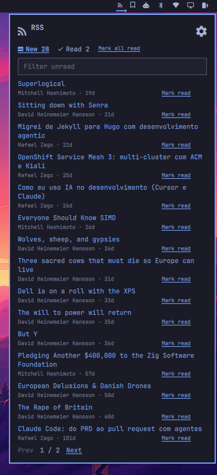
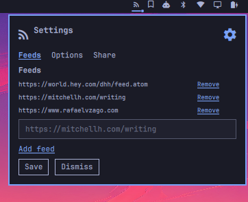
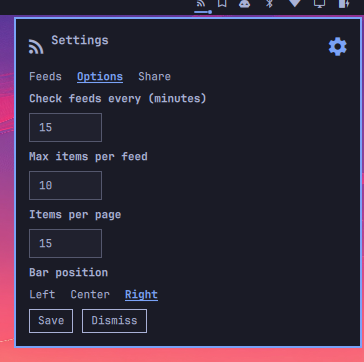

# Omarchy RSS plugin

RSS is an Omarchy bar widget for keeping up with recent posts from RSS and Atom feeds. It puts the latest items in one panel, remembers what you have read, and changes its bar icon when new items are waiting.

## Install

Add the plugin from GitHub and enable it:

```bash
omarchy plugin add https://github.com/rafaelvzago/omarchy-rss-plugin.git --enable
```

The widget starts in the right section of the bar. You can move it later from the plugin settings.

## Using the panel

Click the RSS icon to open the panel. A small accent dot appears on the icon when the New list has items. Hover over it to see the exact unread count.

The panel opens on the New tab. New contains items that have not been opened or marked read. Read contains the rest. Both tabs show their item totals, with counts above 99 displayed as `99+`.



The main panel keeps unread and read items in separate tabs. Use the search box to narrow the list, mark individual posts as read, or clear every item in the current result set. The controls at the bottom move between pages when the list is longer than one page.

From the panel you can:

- Open an item's link in your default browser. This marks the item read and closes the panel.
- Mark one item read without opening it.
- Mark every item in the current New result set read. If a filter is active, this applies to all matching results, including results on other pages.
- Filter items by title, excerpt, feed name, link, or identity.
- Move through paginated lists with the Prev and Next controls.

Each row shows the title, feed name, and relative publication time when the feed supplies one. If an item has no title, the plugin uses a plain-text excerpt from its description. Undated items appear below dated items.

## Feeds

The plugin reads RSS 2.0 and Atom 1.0. You can add a direct feed URL or paste a blog page. For an HTML page, the plugin looks for an RSS or Atom discovery link and then tries common feed paths on the same site. Only `https://` feed and article URLs are used. The plugin fetches feed and HTML text, not images. Saved `http://` feeds are ignored until replaced with https.

Items from every configured feed are combined and sorted newest first. The per-feed limit is applied before the lists are combined. Duplicate items are removed by identity: RSS uses `guid` and falls back to `link`; Atom uses `id` and falls back to its alternate link. Items without either identity are skipped.

JSON Feed and RSS 1.0 are not supported. A URL that does not return a supported feed does not add items to the list.

Feeds are checked when the widget starts, after settings are saved, after an import, and on the configured polling interval.

## Settings

Open the cog in the panel header to change the plugin settings.

### Feeds

Add or remove feed URLs. Put one feed or blog URL in each entry.



The Feeds tab lists every configured source. Paste a feed or blog URL into the field, choose Add feed, then save the settings. Remove deletes a source from the draft list; the change takes effect when you save.

### Options

- Check interval: how often feeds are fetched. The default is 15 minutes, and values below 5 minutes are raised to 5.
- Max items per feed: how many recent items to keep from each feed. The default is 10.
- Items per page: how many feed items the panel shows before pagination. The default is 10.
- Bar position: place the widget in the left, center, or right section of the Omarchy bar.



Save applies the settings and fetches the feeds again. Dismiss closes the settings without applying the draft values.

### Share and import

Share copies the configured feed list to the Wayland clipboard as a small JSON payload. This action uses `wl-copy`.

Use Share to copy your feed list to the clipboard. To bring in another list, choose **Import OPML file** to select an OPML or XML file from your desktop, or paste feed text into the field and choose **Import**. The plugin adds those feeds to your saved list and fetches them immediately.

Import accepts any of these formats:

- OPML or XML files containing `xmlUrl` attributes
- A list shared by this plugin
- Plain feed URLs, one per line

Imported feeds are merged with the existing list, duplicates are skipped, and a new fetch starts immediately.

## Read state

The plugin stores the recent items and read identities in:

```text
~/.local/share/omarchy-rss-plugin/state.json
```

Read identities are also mirrored in the widget settings. Opening the panel does not mark anything read. An item moves to Read only when you open its link or use a mark-read action.

The New count covers the current recent lists, not a permanent backlog. An item no longer counts once it falls outside the configured per-feed limit.

## Update and reload

Update a Git-installed copy with:

```bash
omarchy plugin update io.github.rafaelvzago.rss
```

Files under `~/.config/omarchy/plugins/` normally reload when saved. To force Omarchy to scan plugin files again, run:

```bash
omarchy-shell shell rescanPlugins
```

If the shell is not running or the rescan does not pick up the change, restart it:

```bash
omarchy restart shell
```

## Development

The plugin is split into the bar entry point (`BarWidget.qml`), the panel (`Panel.qml`), and parsing and state helpers (`Model.js`).

Run the model tests with:

```bash
node --test tests/*.mjs
```

Validate the plugin manifest with:

```bash
omarchy plugin validate .
```

## License

[MIT](LICENSE)
