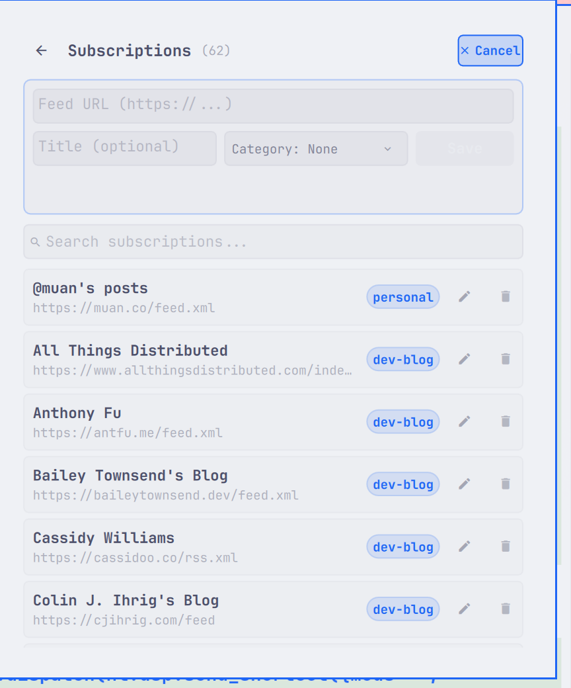
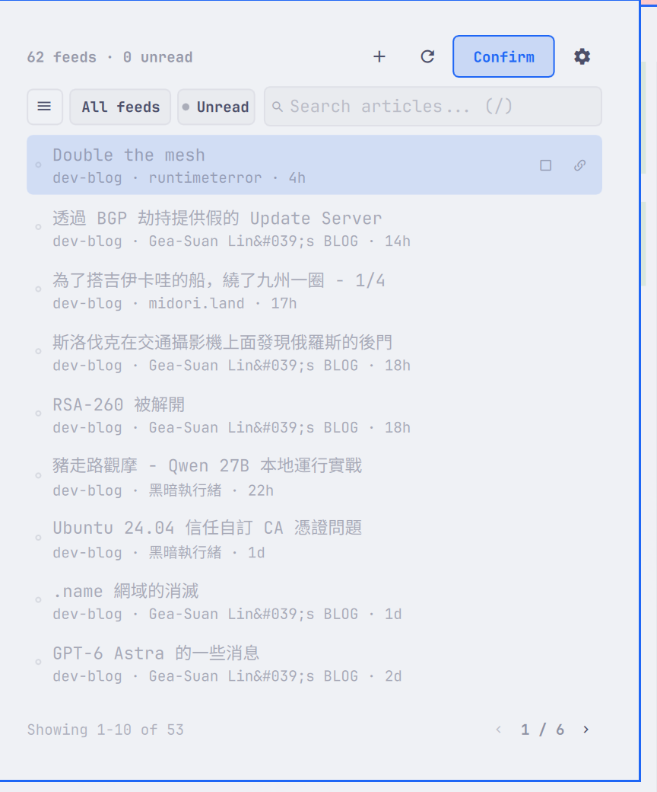
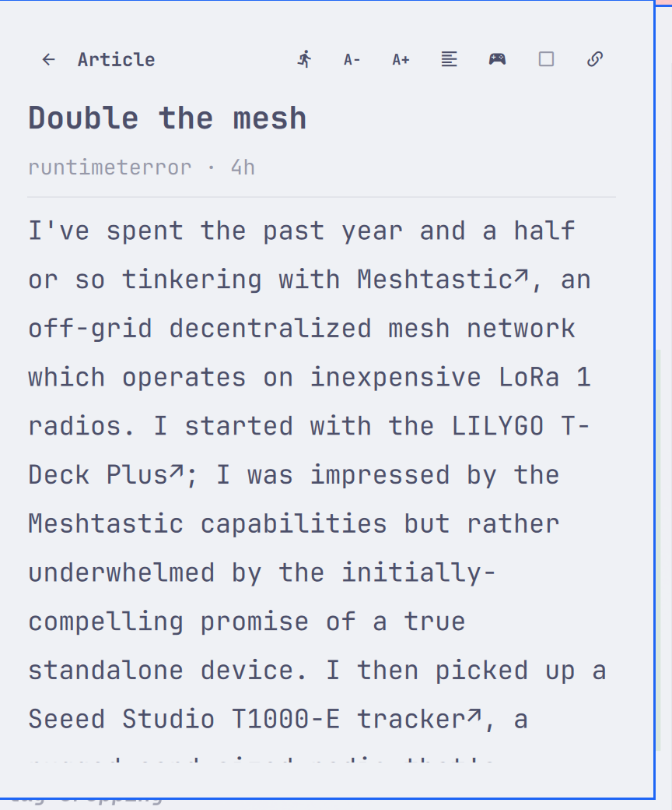

# Omarchy RSS Client

A fork of [`sanjyay/rss-reeder`](https://github.com/sanjyay/rss-reeder) for Omarchy.

**Attribution chain:** [`rafaelvzago/omarchy-rss-plugin`](https://github.com/rafaelvzago/omarchy-rss-plugin) → [`sanjyay/rss-reeder`](https://github.com/sanjyay/rss-reeder) → this repo. MIT license continues from the original author (Rafael Vzago); this fork preserves upstream attribution.

**Supported feeds:** public HTTPS feed URLs only. Do not add private feeds that embed tokens in the path (for example `/feed/<token>.xml`); those cannot be detected and rejected the way userinfo or secret query parameters are.

## Features added in this fork

### Quick add feed

<details>
<summary>open the feed composer directly from the reader top bar</summary>



</details>

### Edit existing feeds 

<details>
<summary>update a feed URL, title, or category from Manage feeds using the same composer as add feed.</summary>
</details>

### Cleaner Manage feeds list

<details>
<summary>
removes the unused per-feed enable/disable circle and keeps edit/delete actions focused.
</summary>
</details>

### Mark all read action

<details>
<summary>quickly mark the current unread articles as read from the reader UI</summary>



</details>

### Zen mode for reading

<details>
<summary>open the article in Zen mode</summary>



</details>

## Bugfix & improvement

- **Category dropdown hit-testing fix**: improves category selection behavior so the dropdown/overlay handles pointer interaction correctly.

## Requirements

Runtime dependencies (typically already present on Omarchy / Arch):

- `curl` — feed and article fetching
- `python3` (`python` package) — OPML import validation and export file chooser helper
- `python-gobject` — PyGObject (`gi` / Gio / GLib) for the XDG FileChooser portal save dialog
- `xdg-desktop-portal` — desktop portal backend used by the save dialog
- `omarchy-file-select` — OPML import file picker (provided by Omarchy)

## Install

```bash
omarchy plugin add https://github.com/siygle/omarchy-rss-client.git --enable
omarchy-restart-shell
```

## Update

```bash
omarchy plugin update io.github.siygle.omarchy-rss-client
omarchy-restart-shell
```

## Remove

```bash
omarchy plugin remove io.github.siygle.omarchy-rss-client
omarchy-restart-shell
```

Optional local data cleanup:

```bash
rm -rf ~/.local/share/omarchy-rss-client
```

## License

MIT. See [LICENSE](LICENSE).
