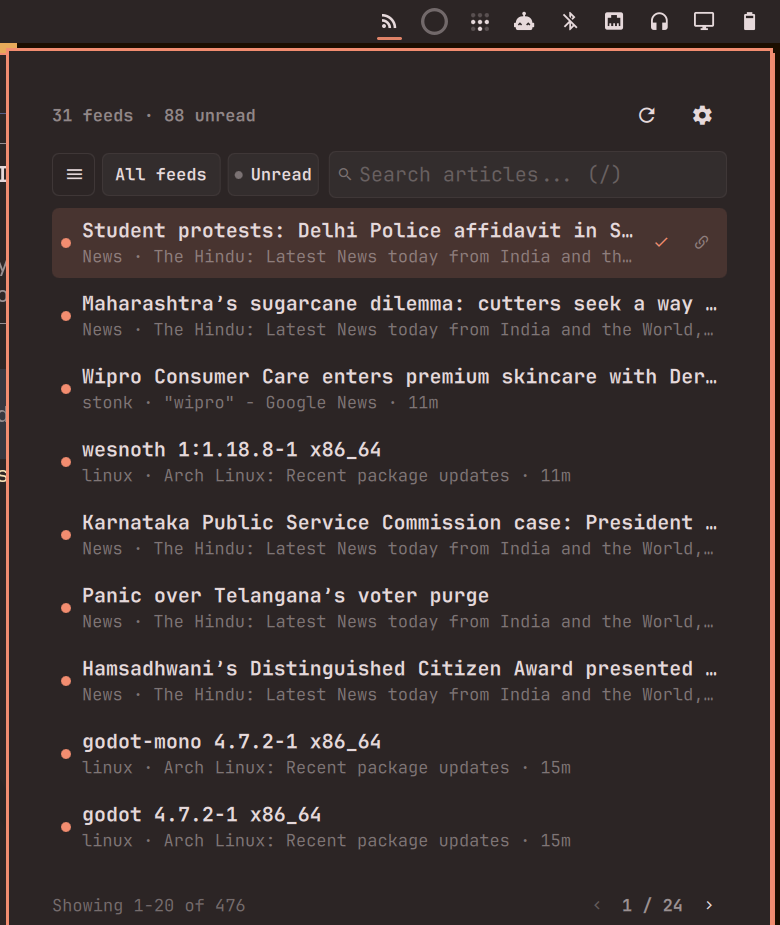
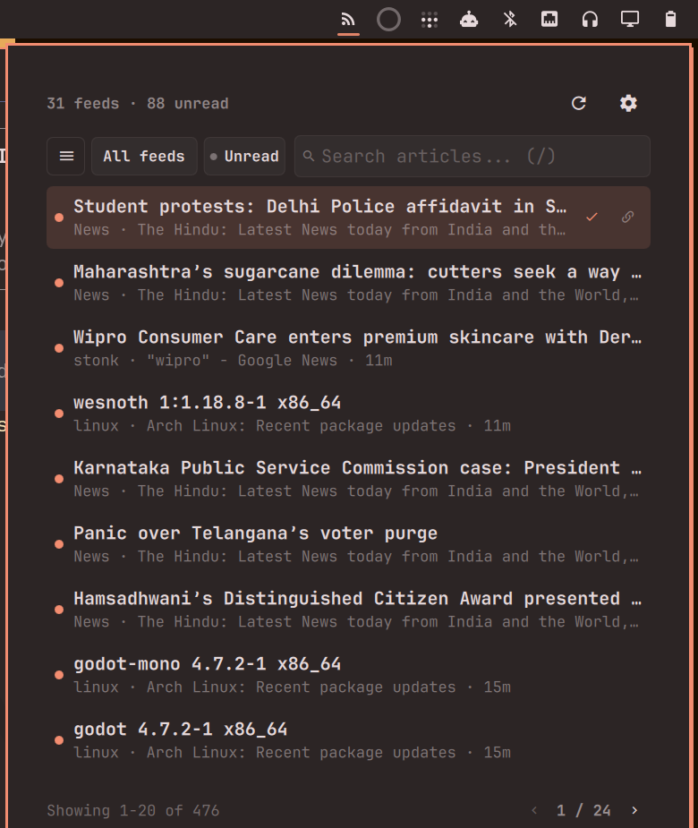
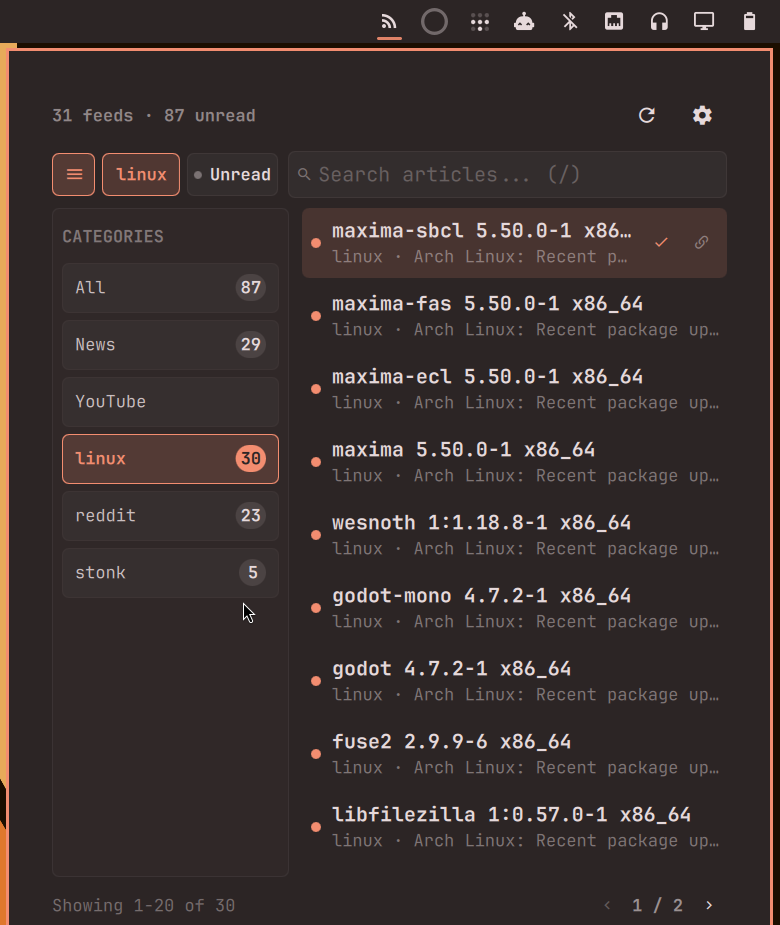
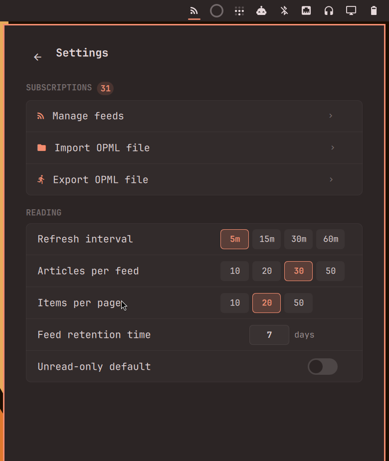

# RSS-Reeder

A native RSS and Atom reader for the Omarchy bar, with OPML import/export, categories, unread tracking, search, and configurable retention.



---

## Features

- **RSS & Atom Support**: Fetches RSS 2.0 and Atom 1.0 feeds over secure HTTPS.
- **Omarchy Bar Integration**: Seamless desktop bar widget with clean unread status and quick popup launcher.
- **Category Drawer**: Group subscriptions into folders and filter articles instantly by category.
- **Category Selection & Creation**: Choose existing categories with alphabetical sorting or create new categories inline when adding feeds.
- **Search & Filtering**: Live instantaneous search across article titles, snippets, feed sources, and categories.
- **Unread Tracking**: Mark articles as read/unread manually or automatically upon opening; filter to unread-only articles anytime.
- **OPML Import & Export**: Full OPML 2.0 file import and export with folder preservation via native desktop file choosers.
- **Configurable Retention**: Automatically prunes stale articles from local cache based on custom retention days (1–3650 days).
- **Keyboard Navigation**: Fast vim-friendly navigation for browsing, searching, refreshing, and toggling categories.
- **Subscription Management**: Add feeds with autodiscovery, rename titles, enable/disable feeds, or delete feeds with one click.
- **Persistent State**: Read status and cached articles persist across desktop reboots and shell reloads.

---

## Screenshots

### Reader



### Categories



### Subscription Management


### Settings



---

## Installation

RSS-Reeder is a third-party Omarchy plugin. You can install and enable it directly using the Omarchy CLI:

```bash
omarchy plugin add https://github.com/sanjyay/rss-reeder.git --enable
```

After installation, reload the desktop shell if needed:

```bash
omarchy-restart-shell
```

The RSS-Reeder icon (`󰑫`) will appear in the right section of your Omarchy bar.

### Updating

To update to the latest release:

```bash
omarchy plugin update io.github.sanjyay.rss-reeder
omarchy-restart-shell
```

---

## Usage

1. **Open the Reader**: Click the RSS-Reeder icon in your bar or summon it via keyboard shortcut.
2. **Add Feeds**: Open **Settings** (`󰒓`) → **Manage feeds** (`+ Add feed`) to add feed URLs manually.
3. **Import Subscriptions**: Click **Import OPML file** in Settings to load an existing `.opml` or `.xml` subscription list.
4. **Browse & Read**:
   - Press `/` to search articles.
   - Press `c` or click `󰄲` to open the Category Drawer and filter by topic.
   - Click `● Unread` to show only unread news.
   - Click any article (or press `Enter`) to open it in your default web browser.

---

## OPML Import & Export

RSS-Reeder provides native desktop integration for OPML subscription management:

- **Import OPML File**: Opens the native desktop file chooser to select `.opml` or `.xml` files. Imports all valid HTTPS feed URLs and restores their category folders. The import operation runs in the background and safely completes even if the popup closes.
- **Export OPML File**: Generates standard OPML 2.0 XML containing all your active subscriptions, feed titles, URLs, and folder structures, saving it to your chosen directory via the native save file picker.

---

## Keyboard Shortcuts

When the RSS-Reeder popup is open:

| Shortcut | Action |
| :--- | :--- |
| `j` / `Down` | Select next article |
| `k` / `Up` | Select previous article |
| `Enter` / `Return` | Open selected article in default browser |
| `m` | Mark selected article as read / unread |
| `r` | Refresh all configured feeds |
| `/` | Focus search bar |
| `c` | Toggle Category Drawer |
| `Escape` | Unfocus input or close active layer |

---

## Settings

Click `󰒓` in the reader header to access Settings:

- **Refresh Interval**: Choose background polling frequency (`5m`, `15m`, `30m`, `60m`).
- **Articles Per Feed**: Maximum recent articles loaded per subscription (`10`, `20`, `30`, `50`).
- **Items Per Page**: Number of articles displayed per page (`10`, `20`, `50`).
- **Feed Retention Time**: Number of days (1 to 3650 days, default: `30`) to keep cached articles. Articles older than this threshold are pruned from local history during cleanup; your subscriptions themselves remain untouched.
- **Unread-Only Default**: When enabled, the reader starts in unread-only mode every time it is opened.

---

## Data & State

- **Plugin Configuration**: Settings and subscriptions are stored in standard Omarchy configuration (`~/.config/omarchy/shell.json`).
- **Local Cache & Read History**: Cached articles and read status identities are saved locally in:
  ```text
  ~/.local/share/omarchy-rss-reeder/state.json
  ```
  *(Legacy state from `~/.local/share/omarchy-rss-plugin/state.json` is automatically migrated on initial run).*

---

## Removal

To disable and remove the RSS-Reeder plugin:

```bash
omarchy plugin remove io.github.sanjyay.rss-reeder
omarchy-restart-shell
```

### Optional Data Cleanup

To completely remove local cached articles and read history:

```bash
rm -rf ~/.local/share/omarchy-rss-reeder
```

---

## Dependencies

RSS-Reeder uses native utilities already included in standard Omarchy installations:

- `curl`: Secure background feed fetching with size and redirect limits.
- `python3` (with `python-gobject` / `Gio`): Non-blocking native desktop portal integration (`org.freedesktop.portal.FileChooser`) for file selection.

No additional third-party dependencies need to be installed.

---

## Security & Privacy

- **HTTPS Only**: Only secure `https://` URLs are fetched and launched. Insecure `http://` or non-web protocols are rejected.
- **Local Processing**: Feeds are fetched directly from source servers. No intermediate proxy, tracking, or telemetry is used.
- **Safe File Operations**: OPML import and export operations interact strictly with user-selected files using argument-safe execution without shell string interpolation.
- **Native Execution**: Like all Omarchy plugins, code executes locally with user permissions.

---

## License & Acknowledgements

RSS-Reeder is licensed under the [MIT License](LICENSE).

### Acknowledgements
Originally inspired by and derived from the MIT-licensed Omarchy RSS plugin by Rafael Vzago.
